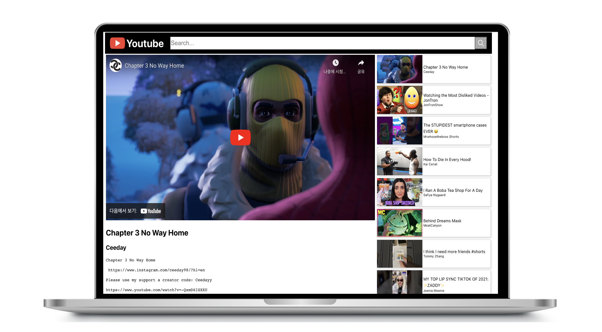

# React를 이용해 만드는 Youtube App
 

### 기술스택 
- React Hook
- JS(ES6+)
- HTML5
- PostCSS
  

### 실행 페이지 🔗 
- https://salangdung-i.github.io/youtube/
 

### 구현한 방법과 이유에 대한 간략한 내용
Youtube API를 이용하여 만드는 Youtube viewer 입니다.   
📖 첫 번째 구현 시 강의를 보고 공부하며 구현하였습니다.   
📖 두 번째 구현 시에 다시 초기 상태로 만든 후 혼자 만들어 보았습니다.
  

### 구현하면서 어려웠던 점과 해결 방법 (Error Handling Log)

1. img 경로 
어떤 이유인지 모르겠지만 기존에 public에서 이미지 파일을 불러올 때 상대경로를 입력해주면 이상 없이 불러왔었는데, 계속해서 엑박이 뜨는 현상이 발생했습니다. 공식문서를 보고 이 문제를 해결했습니다.  
https://create-react-app.dev/docs/using-the-public-folder/

2. 403 Error
youtube api를 가져올 때 URL은 맞지만 계속해서 403 에러가 발생해서 데이터를 가져오지 못했습니다. 찾아보니 YouTube Data API를 활성화하는 프로젝트의 기본 할당량은 하루 10,000단위로 이를 초과했기 때문에 생기는 오류였습니다. 보통 이 오류를 해결하기 위해서 키 제한을 업데이트하는데 저는 이전에 받아온 데이터를 JSON 파일에 저장해놓고 뿌려주는 방법을 시도해 보기로 했습니다.
    - 키제한을 업데이트하기 
    https://stackoverflow.com/questions/39543105/youtube-api-key
    - 임시 JSON파일로 데이터 뿌려주기   
 
서비스 로직에서 fetch를 한 후 받아온 response의 status가 403이면 public/data/mostPopular.json public/data/searchData.json의 데이터를 불러와 넘겨주는 로직을 만들었습니다.
